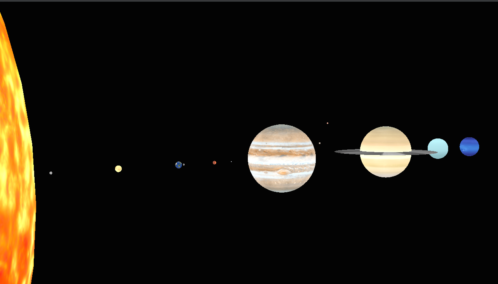

*TODO*: Please edit the following information in your final project

## To Scale Solar System Simulator

## https://www.youtube.com/watch?v=fWyO-9nj0wg

## Edit this line: Put a few screenshots of your project here (see deliverables).

* Name and partners name(At most teams of 2 folks total)
  * Team member 1: *Calvin Crosby*
  
* How many hours did it take you to complete this final project? 30 hours 
* Did you collaborate or share ideas with any other students/TAs/Professors? No
* Did you use any external resources? Yes
  * Note it is fair to utilize some tutorials--cite them here. You **must** add your own personal touch however!
  * *https://www.reddit.com/r/QuakeChampions/comments/98k01d/fov_and_sens_need_help/*
  * *https://people.southwestern.edu/~kamenm/auburn/w00harris.html*
  * *https://www.solarsystemscope.com/textures/*
  * (Optional) What was the most interesting part of the Final Assignment? How could the instructor improve the final project? Seeing how truly large the sun is in comparion to us and the other rocky planets was very cool once I scaled them correctly. I had to implement a feature that upscales rocky planets just so you could see them well when they begin moving in the simulation.

### Rubric

<table>
  <tbody>
    <tr>
      <th>Points</th>
      <th align="center">Description</th>
    </tr>
    <tr>
      <td>(33.3%) Project Completion</td>
     <td align="left"><ul><li>Does the project compile and run.</li><li>Is it polished without any bugs (No weird visual artifacts).</li><li>Did you make a video?</li><li>Did you add a screenshot of your project to the repository?</li></ul></td>
    </tr>
    <tr>
      <td>(33.3%) Technical</td>
      <td align="left"><ul><li>Was the implementation of the project challenging?</li><li>Even if you followed a tutoral, it should not be trivial, and have some personal touch to it.</li><li>Did you have to organize/process a sufficient amount of data?</li><li>Was it clear you consulted some outside resources that go above and beyond the scope of this class</li></ul></td>
    </tr>
    <tr>
      <td>(33.4%) Creativity</td>
      <td align="left"><ul><li>How visually appealing is the scene?<ul><li>Note: There should be some 'wow' factor--instructors discretion is used here.</li></ul></li><li>How original is the project<ul><li>Again, did you enhance a tutorial and do something unique or just go by the book?</li></ul></li></ul></td>
    </tr>
  </tbody>
</table>
